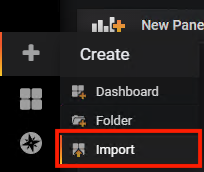
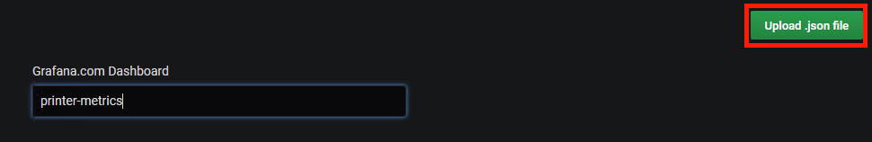

# check_snmp_printer
Icinga Plugin for Checking SNMP Printer Status (Trays, Consumables and Pagecounts) which includes PerfData.

Supported Printer Models:

* Canon
* HP
* Xerox
* Ricoh
* Brother
* Lexmark
* Kyocera
* Olivetti

__Your specific printer not supported?  Open an issue on Github and we'll work to get it supported.__

Forked and modified from Franky Van Liedekerke's 2014 version.

**Consumables**


**Tray Status**


**Page Count**


## Getting Started

These instructions assume your Icinga2 is installed on a RHEL/CentOS system.  You may need to modify slightly to work with other systems.

### Prerequisites

Perl >= 5.10

Net::SNMP perl module

Nagios plugins installed and located in /usr/lib64/nagios/plugins


### Installing

Copy check_snmp_printer into your plugin directory and give it executable writes:

```
sudo cp ./check_snmp_printer /usr/lib64/nagios/plugins/
chmod a+x /usr/lib64/nagios/plugins/check_snmp_printer
```

Copy printers.conf into plugins-contrib.d folder:

```
sudo cp ./printers.conf /usr/share/icinga2/include/plugins-contrib.d/
```
Append services-printers.conf to the end of your Icinga2 services.conf:

```
cat ./services-printers.conf >> /etc/icinga2/conf.d/services.conf
```

If using Graphite, copy graphite templates to Icinga2 Graphite template folder:

```
sudo cp ./printer-consumables.ini /usr/share/icingaweb2/modules/graphite/templates/
sudo cp ./printer-trays.ini /usr/share/icingaweb2/modules/graphite/templates/
sudo cp ./printer-pagecount.ini /usr/share/icingaweb2/modules/graphite/templates/
```

If using Grafana, import JSON Dashboard (Graphite or InfluxDB) file and add graph dashboard information into module making sure to name the Dashboard printer-metrics:





```
sudo cat printer-metrics-graphs.ini >> /etc/icingaweb2/modules/grafana/graphs.ini
```

Restart Icinga2:

```
sudo systemctl restart icinga2
```

## Acknowledgments

* Franky Van Liedekerke for porting Jason Leonard's initial BASH script to Perl.
* Jason Leonard for writing the initial code that this was ultimately based upon.
